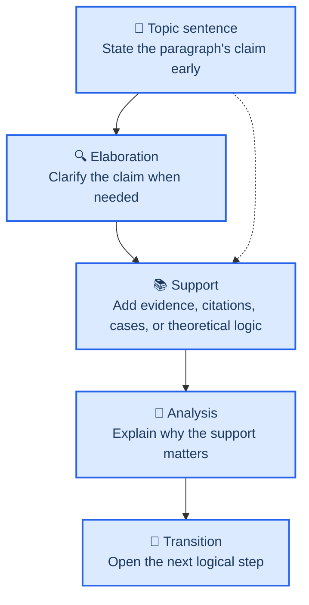

# Paragraph Pyramid Structure

Use this reference whenever drafting or auditing introduction paragraphs.

Paragraph-level logic should mirror document-level logic. Each substantive paragraph should function as a small pyramid rather than as a loose pile of sentences.

## Core Rule

Write each substantive paragraph as:

1. `Topic sentence`
2. `Optional elaboration`
3. `Support`
4. `Analysis`
5. `Transition`

The first sentence should usually carry the paragraph's point. Do not spend the first sentence merely circling the topic.

## Topic Sentence

The topic sentence is the paragraph's entry point and argumentative anchor.

### What it should do

- state the paragraph's main claim early
- tell the reader why this paragraph exists
- narrow the paragraph to one logical job

### Practical rule

- In Chinese, prefer a short declarative sentence and keep it within about 30 characters when possible.
- In English, prefer one short sentence over a long sentence with multiple nested clauses.

### Common topic-sentence forms

- `Direct claim`
  State the paragraph's point directly.
- `Question-driven`
  Raise the question the paragraph will answer.
- `Carry-forward`
  Pick up the last paragraph and move one step further.

### Avoid

- topic sentences that are so broad the reader cannot predict the paragraph's direction
- topic sentences that are so specific they leave no room for support and analysis
- quotations as topic sentences

## Support

The support sentences should stay in the same logical family as the topic sentence. Their purpose is to support the paragraph's claim by answering the first important question the reader is likely to ask after reading the topic sentence.

Typical reader questions include:

- `How do you know?`
- `Why should I believe this?`
- `Why is this the right interpretation?`
- `What makes this claim plausible in the real world or in theory?`

### What can count as support

- prior literature
- data
- real-world cases or concrete events
- examples
- design details
- mature theoretical logic

### Rule

Do not stack support without control. Each supporting sentence should help the same paragraph claim rather than introduce a new claim.

### Three especially useful support types

1. `Existing literature support`
   Use prior studies, review articles, books, or reports to provide scholarly grounding.
2. `Real-world case support`
   Use concrete events, organizational examples, or visible patterns to make the claim vivid and credible.
3. `Mature theoretical support`
   Use a well-established theory or mechanism to show why the claim follows logically even before new empirical evidence is introduced.

Support does not always need to come immediately after the topic sentence. When the claim needs unpacking first, insert one or two elaboration sentences before the support.

### Support arrangement patterns

The issue is not only what kind of support to use, but also how to arrange it. The most useful patterns are:

1. `Literature -> literature -> interpretation`
   Use when the paragraph mainly establishes a scholarly claim.
2. `Literature -> case -> interpretation`
   Use when the paragraph needs both scholarly legitimacy and concrete vividness.
3. `Theory -> implication -> literature`
   Use when the paragraph is mechanism-heavy and the logic needs to be clear before citations accumulate.
4. `Context fact -> literature -> implication`
   Use when the paragraph opens on a real-world setting but must quickly connect back to research.
5. `Discretion/variation claim -> concrete illustration -> analytical takeaway`
   Use when the paper argues that actors have room to choose among responses.

### A useful sequencing rule

Within one paragraph, support often works best when it moves:

- from broad to narrow
- from established to focal
- from abstract to concrete
- from evidence to implication

Do not randomize these layers.

## Optional Elaboration

Sometimes the topic sentence states the claim clearly, but the reader still needs a narrower definition, scope condition, or interpretive setup before the support can do real work.

### What elaboration should do

- unpack the paragraph's central claim
- define the precise angle of the paragraph
- narrow the meaning of a term or distinction
- set up what kind of support will follow

### Rule

Use elaboration only when it improves comprehension. Do not let it become padded throat-clearing before the real argument starts.

One especially useful elaboration move is to narrow the kind of support the reader should expect next. For example, after a claim about board influence, an elaboration sentence may clarify that the paper is interested in operational decisions rather than only financial or strategic ones.

## Analysis

Do not leave the evidence to speak for itself.

### What analysis should do

- explain how the support bears on the claim
- interpret what the cited work implies
- show why the evidence matters for the paper's puzzle or contribution

### Rule

If the paragraph contains evidence but no interpretation, the paragraph is under-argued.

Analysis is also where the paragraph should tell the reader why the support type was relevant. If the paragraph used literature support, analysis should explain what that literature jointly implies. If it used a case, analysis should explain why the case is illustrative rather than merely interesting.

## Literature Support Sentences

Literature support sentences should sound like synthesis, not like bibliographic dumping.

### What literature support sentences should do

- state a substantive point first
- attribute that point to a body of work second
- keep citations as support for the sentence, not as the sentence's main content

### Preferred sentence patterns

- `Prior research shows that ...`
- `Existing studies suggest that ...`
- `Recent work has begun to show that ...`
- `A growing literature documents that ...`
- `Research on X has linked Y to Z ...`
- `Scholars have argued that ...`
- `Evidence from prior studies indicates that ...`

### Strong pattern

`Prior studies show that recall speed varies with defect and product characteristics, prior recall experience, and supply chain conditions (citations).`

The claim comes first. The citations support the claim.

### Weak pattern

`Hora et al. (2011), Eilert et al. (2017), and Astvansh et al. (2022) studied recall timing.`

This names papers but does not tell the reader what the literature collectively says.

### Rules for literature-type support

- lead with the finding, not the author name
- synthesize multiple papers around one point whenever possible
- use dense citation lists only when they support a clearly stated collective claim
- do not let one literature support sentence carry more than one main finding
- after one or two literature support sentences, add analysis that explains why the reviewed literature leaves room for the paper

### When to name a specific study directly

Name a specific study when:

- it is the closest anchor paper
- it offers a distinctive mechanism or method
- it creates a useful contrast with your argument
- it provides an especially vivid or canonical example

If you name the paper, still state the point, not just the citation.

## Transition

A paragraph should not simply stop after making its point. It should create a bridge to the next step.

### What transition sentences can do

- summarize the local implication
- sharpen the unresolved issue
- move from context to literature
- move from literature to puzzle
- move from puzzle to paper move

### Rule

A good transition does not repeat the whole paragraph. It tells the reader why the next paragraph must now happen.

## Exceptions

Not every paragraph needs the four parts in equal weight.

- `Opening hook paragraphs`
  May use lighter support if the goal is to frame the phenomenon quickly.
- `Roadmap paragraphs`
  Are compressed structural paragraphs and may omit full evidence-analysis structure.
- `Very short bridge paragraphs`
  Can work when they perform a narrow transition function, but do not let the introduction become a chain of thin fragments.

## Common Paragraph Mistakes

- `观点分散`
  More than one core claim in the same paragraph.
- `内容单薄`
  Too little support to make the claim persuasive.
- `支撑失准`
  The support does not answer the reader's first key question about the topic sentence.
- `文献堆砌`
  Citations are piled up without first stating the collective point they support.
- `分析缺位`
  Evidence appears, but the writer never explains why it matters.
- `过渡生硬`
  The paragraph ends without preparing the next move.
- `主题句失焦`
  The first sentence is too vague or too overloaded.
- `拓展句失控`
  Too many explanatory sentences appear before the paragraph provides real support.

## QC Checklist

When auditing a paragraph, ask:

- `Topic`
  Can I identify the claim in the first sentence?
- `Elaboration`
  If there is an elaboration step, does it clarify the claim rather than delay it?
- `Support`
  Is there evidence, literature, a case, or theoretical logic that belongs to that claim and answers the reader's first key question?
- `Support order`
  Do the support sentences appear in a sensible order rather than as a random stack?
- `Literature language`
  If literature is used, does the sentence synthesize what the literature shows instead of merely naming papers?
- `Analysis`
  Does the paragraph interpret the support rather than merely display it?
- `Transition`
  Does the last sentence prepare the next paragraph?
- `Unity`
  Does the paragraph do one main job rather than several?
